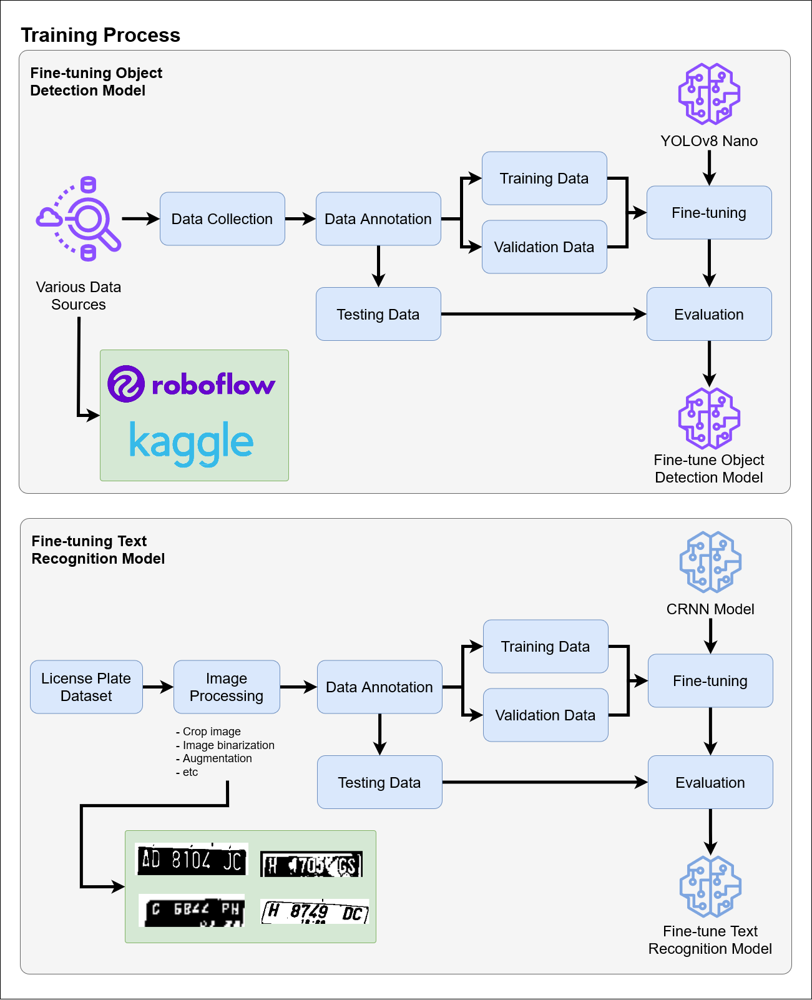
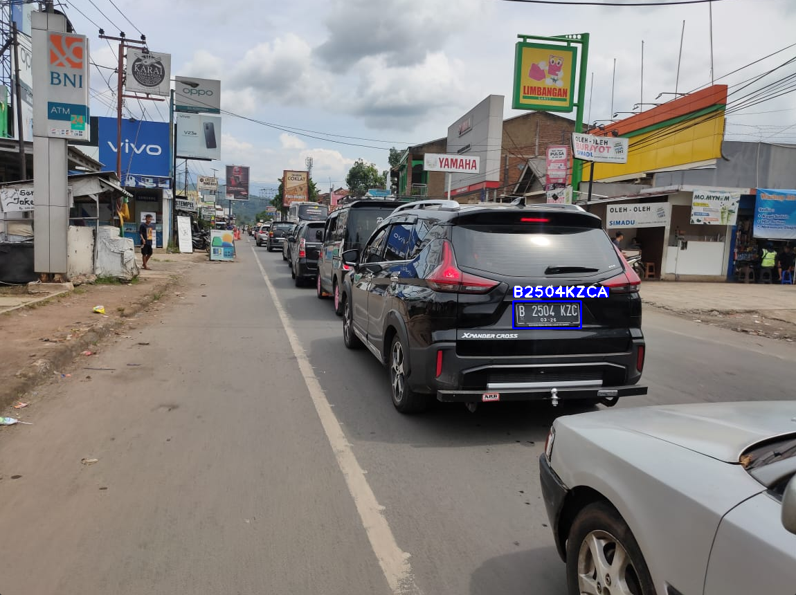

<a name="readme-top"></a>

<!-- PROJECT LOGO -->
<br />
<div align="center">
<h3 align="center">License Plate Detection</h3>
  <p align="center">
    Developing a machine learning model to detect license plates and recognize it as a text.
    <br />
    <br />
    <!--<a href="#">View Demo</a>-->
  </p>
</div>


<!-- TABLE OF CONTENTS -->
<details>
  <summary>Table of Contents</summary>
  <ol>
    <li>
      <a href="#about-the-project">About The Project</a>
    </li>
    <li>
      <a href="#getting-started">Getting Started</a>
      <ul>
        <li><a href="#prerequisites">Prerequisites</a></li>
        <li><a href="#installation">Installation</a></li>
      </ul>
    </li>
    <li><a href="#usage">Usage</a></li>
    <li><a href="#To Do">To Do</a></li>
  </ol>
</details>


<!-- ABOUT THE PROJECT -->
## About The Project

This project aims to demonstrate the machine learning workflow for building a computer vision project, specifically focusing on license plate detection.


As shown in the image above, the training process involves data collection, data annotation, fine-tuning object detection and text recognition models, image processing, adn data augmentation.


For the inference process, the input frame will be fed into an object detection model that has been fine-tuned. The detected license plate will then be processed (i.e. converted to grayscale, binarization, etc.) and fed into a text recognition model. Once the text has been detected, it will be combined with the original frame as the final result.

<p align="right">(<a href="#readme-top">back to top</a>)</p>


<!--
<!-- GETTING STARTED -->
## Getting Started

Here are a few steps to follow in order to run the project locally on your computer.

### Prerequisites
Before doing the installation, make sure you have Python installed on your computer, I used `python 3.12.1` during the development.

### Installation
1. Clone the repo
    ```sh
    git clone https://github.com/alfiannajih/license-plate-detection
    ```
2. Change your directory
    ```sh
    cd license-plate-detection
    ```
3. Install the dependencies
    ```sh
    pip install -r requirements.txt
    ```
4. Run the sample to check if the program work correctly
    ```sh
    python main.py --mode image --file_path sample_input.jpg
    ```

<p align="right">(<a href="#readme-top">back to top</a>)</p>


<!-- USAGE EXAMPLES -->
## Usage
There are three modes in which the program can be used: `image`, `webcam`, and `video`.
1. Image mode
    
    Run the following command:
    ```sh
    python main.py --mode image --file_path sample_input.jpg
    ```
    You can replace `sample_input.jpg` with the name of your image file. The above commad will use `sample_input.jpg` as an input, just as in the installation process example.
    
    output example:
    

2. Webcam mode

    Run the following command:
    ```sh
    python main.py --mode webcam --webcam_id 0
    ```
    It will open your webcam, allowing you to use it as the input frame.

    output example:
    

<p align="right">(<a href="#readme-top">back to top</a>)</p>


<!-- To Do -->
## To Do

- [x] Collect data
- [x] Object detection model
- [x] Combine model with Optical Character Recognition (OCR)
- [x] Fine tune OCR model


<p align="right">(<a href="#readme-top">back to top</a>)</p>